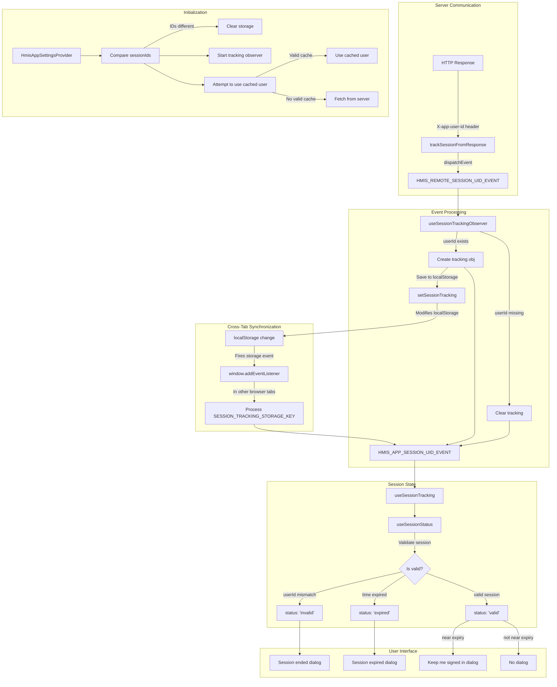

# Session Management Architecture

The session tracking mechanism ensures consistent user session management across multiple browser tabs.

## Key Components

### Local Storage Management
* Only non-sensitive user data stored in localStorage
* Session tracking consists of userId and timestamp for validity checks
* Browser storage events enable cross-tab synchronization

### Session Validation
* Session validity determined by user's sessionDuration property
* Sessions invalidated when users sign out in other tabs or when duration expires

### Server-Client Communication
* Server includes X-app-user-id header in responses to identify current session
* Custom events propagate session changes throughout the application
* All authenticated requests trigger session validation

### User Experience
* Proactive expiration notifications with "Are you still there?" dialogs
* Session keep-alive mechanism via sendSessionKeepalive()

## Implementation Details

1. **Initialization** - `HmisAppSettingsProvider` initializes session tracking and validates browser storage

2. **Event Propagation** - Three custom events control session state:
   - `HMIS_SESSION_UID_HEADER`: Server header containing session userId
   - `HMIS_REMOTE_SESSION_UID_EVENT`: Dispatched when receiving server response
   - `HMIS_APP_SESSION_UID_EVENT`: Dispatched to update UI components

3. **Cross-Tab Coordination**:
   - When a tab changes session state, it updates localStorage via `setSessionTracking`
   - Browser's built-in storage event fires in all other tabs
   - Each tab's storage event listener processes the change and updates UI accordingly
   - This ensures all tabs simultaneously reflect sign-outs or session updates

4. **Session Recovery** - When a session becomes invalid, the system attempts page reload once to reestablish it

5. **Timing Mechanism** - `useSessionStatus` calculates remaining time and schedules appropriate UI notifications
