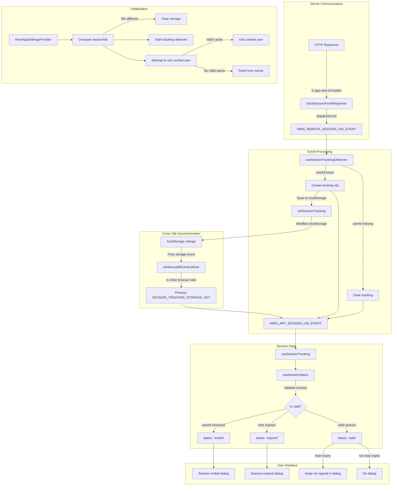

# Session Management Architecture

The session tracking mechanism ensures consistent user session management across multiple browser tabs.

## Key Components

### Local Storage Management
* Only non-sensitive user data stored in localStorage
* Session tracking consists of userId and timestamp for validity checks
* Browser storage events enable cross-tab synchronization

### Session Validation
* Session validity determined by user's sessionDuration property
* Sessions invalidated when users sign out in other tabs or when duration expires

### Server-Client Communication
* Server includes X-app-user-id header in responses to identify current session
* Custom events propagate session changes throughout the application
* All authenticated requests trigger session validation

### User Experience
* Proactive expiration notifications with "Are you still there?" dialogs
* Session keep-alive mechanism via sendSessionKeepalive()

```mermaid
flowchart TD
    subgraph ServerEvents[Server Communication]
        A[HTTP Response] -- "X-app-user-id header" --> B[trackSessionFromResponse]
        B -- "dispatchEvent" --> C[HMIS_REMOTE_SESSION_UID_EVENT]
    end

    subgraph EventHandling[Event Processing]
        C --> D[useSessionTrackingObserver]
        D -- "userId exists" --> E1[Create tracking obj]
        D -- "userId missing" --> E2[Clear tracking]
        E1 -- "Save to localStorage" --> F1[setSessionTracking]
        E1 --> G[HMIS_APP_SESSION_UID_EVENT]
        E2 --> G
    end

    subgraph CrossTabSync[Cross-Tab Synchronization]
        F1 -- "Modifies localStorage" --> S1[localStorage change]
        S1 -- "Fires storage event" --> S2[window.addEventListener]
        S2 -- "In other browser tabs" --> S3[Process SESSION_TRACKING_STORAGE_KEY]
        S3 --> G
    end

    subgraph SessionManagement[Session State]
        G --> H[useSessionTracking]
        H --> I[useSessionStatus]
        I -- "Validate session" --> J{Is valid?}
        J -- "userId mismatch" --> K1[status: 'invalid']
        J -- "time expired" --> K2[status: 'expired']
        J -- "valid session" --> K3[status: 'valid']
    end

    subgraph UIFeedback[User Interface]
        K1 --> L1[Session ended dialog]
        K2 --> L2[Session expired dialog]
        K3 -- "near expiry" --> L3[Keep me signed in dialog]
        K3 -- "not near expiry" --> L4[No dialog]
    end

    subgraph AppInit[Initialization]
        O[HmisAppSettingsProvider] --> P[Compare sessionIds]
        P -- "IDs different" --> Q[Clear storage]
        P --> R[Start tracking observer]
        P --> S[Attempt to use cached user]
        S -- "Valid cache" --> T1[Use cached user]
        S -- "No valid cache" --> T2[Fetch from server]
    end
```

## Implementation Details

1. **Initialization** - `HmisAppSettingsProvider` initializes session tracking and validates browser storage

2. **Event Propagation** - Three custom events control session state:
   - `HMIS_SESSION_UID_HEADER`: Server header containing session userId
   - `HMIS_REMOTE_SESSION_UID_EVENT`: Dispatched when receiving server response
   - `HMIS_APP_SESSION_UID_EVENT`: Dispatched to update UI components

3. **Cross-Tab Coordination**:
   - When a tab changes session state, it updates localStorage via `setSessionTracking`
   - Browser's built-in storage event fires in all other tabs
   - Each tab's storage event listener processes the change and updates UI accordingly
   - This ensures all tabs simultaneously reflect sign-outs or session updates

4. **Session Recovery** - When a session becomes invalid, the system attempts page reload once to reestablish it

5. **Timing Mechanism** - `useSessionStatus` calculates remaining time and schedules appropriate UI notifications

## Terminal account errors vs. re-authentication

Two states are terminal — re-authenticating cannot clear them — so they must not
take the "session ended" re-auth path above:

* **Account deactivated** — the user's warehouse account was disabled.
* **No warehouse account** — the signed-in identity has no warehouse account.

How each auth arm signals them, and what the SPA does:

| State | `AUTH_METHOD=devise` (backend) | `AUTH_METHOD=jwt` (backend) | SPA result |
| --- | --- | --- | --- |
| Session ended / signed out elsewhere | `401` (`custom_auth_failure.rb`, type `unauthenticated`/`inactive`) | `401` (proxy-level, or a tokenless race) | Session-ended dialog → reload → login |
| Account deactivated | `401` (goes through the re-auth path) | `accountError` on the bootstrap payload | Terminal page (see below) |
| No warehouse account | `401` | `accountError` on the bootstrap payload | Terminal page |

Under `jwt` these are read at **bootstrap, not from a failed request**.
`GET /hmis/user.json` skips authentication (it is an oauth2-proxy
`skip_auth_route` and legitimately arrives with no token), so it answers `200`
for all three of signed-out, deactivated, and no-account. It distinguishes them
with an `accountError` field on that payload
(`jwt_hmis_current_user.rb#terminal_account_error`); a tokenless request has no
such field and stays the ordinary signed-out case. `fetchCurrentUser` returns it
alongside the user, and `HmisAppSettingsProvider` replaces the app with a
terminal dialog whose only action is to sign out.

Reading it here rather than from a request failure is the point. The SPA only
mounts its authenticated routes once it has a user, so a user in either state
would otherwise never issue the request that fails — they would land on the
sign-in page, sign in, and be returned by the proxy to the same empty payload,
with no exit. Guarded routes still answer `403` with these types for a
mid-session change; nothing in the SPA reads those, and the next reload picks the
state up from the bootstrap payload.

`DELETE /hmis/logout` is the exception: the terminal dialog's only action is
sign-out, so under `jwt` that route resolves a holder off the token alone and does
not require a `current_hmis_user`. Without that, a deactivated / no-account user
could never sign out, and on a shared machine the next person would inherit the
live IdP session.

The `devise` arm reaches the same states as a 401 and keeps using the re-auth
path, so this terminal-page flow is specific to the `jwt` arm.
